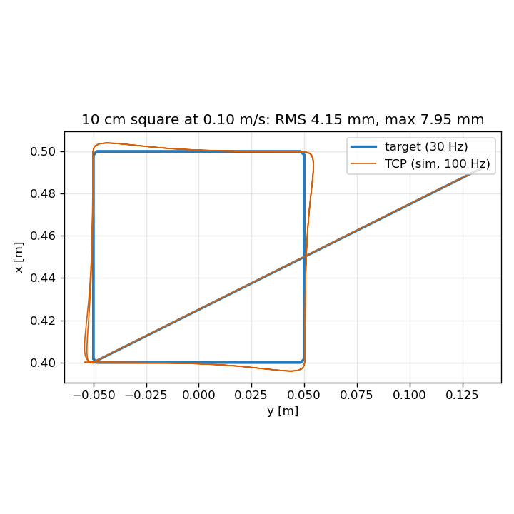

# Webcam Hand Teleop for Robot Arms (ROS 2 + MuJoCo)

Teleoperate a robot arm with your bare hands and an ordinary webcam. You don't need a leader arm, VR
headset, data glove or SpaceMouse. The right hand drives the gripper position, the left hand's
pinch opens and closes it, and a fist works as a clutch. The reference setup is a simulated
Universal Robots UR5e with a Robotiq 2F-85 gripper in MuJoCo, built so the hand front end can be
reused with other arms.

> Measured live: **20/20 pick-and-place**, **62 ms** median camera-to-command latency,
> **sub-millimetre** jitter with the hand held still. See [`results/RESULTS.md`](results/RESULTS.md).



## Why

Teleoperation hardware (leader-follower arms, VR rigs, haptic devices) costs hundreds to thousands
of dollars, and it's tied to one lab bench. This project is a **software-only alternative**: a
webcam, a CPU for MediaPipe hand tracking, and a controller that turns noisy hand landmarks into
smooth, safe arm motion. Use it to:

- drive a simulated arm for demos, teaching or testing;
- prototype teleop interfaces before buying hardware;
- as a base for your own robot: the hand → Cartesian-target part is robot-independent.

## Features

- **Hand tracking:** MediaPipe HandLandmarker at 30 fps at up to 1080p, One Euro filtering, and
  open/fist/pinch gestures with debouncing. A live camera window shows the overlay (fps, latency,
  clocks).
- **Clutch with re-anchoring:** open palm = engaged, fist = hold. Re-engaging never makes the arm
  jump, so you can "lift the mouse" to cover a large workspace with small hand motions.
- **C++ differential IK:** damped least squares on MuJoCo Jacobians, singularity-aware damping,
  nullspace posture, joint-speed and joint-limit handling, workspace guard. No MoveIt.
- **Safety:** latched keyboard e-stop (never a gesture), a tracking-fault freeze, scene-reset
  detection, and speed limits on target and gripper.
- **Simulation:** the MuJoCo Menagerie UR5e + 2F-85, a table, a cube and a target, with front and wrist cameras.
  Grasping is stable (200/200 scripted grasp-lifts).
- **Measurement built in:** end-to-end latency stamped from the camera frame, a guided live test
  session, a pick-and-place benchmark and a split-screen demo recorder.
- **Tested:** 60+ unit, gtest and launch tests (`colcon test`), plus CI.

## Requirements

- Ubuntu 22.04 + **ROS 2 Humble** (developed and measured there)
- Python 3.10, `pip install -r requirements.txt` (MuJoCo 3.12, MediaPipe 1.0.1, OpenCV, NumPy < 2)
- Any USB webcam (MJPG recommended); the widest mode that holds 30 fps is picked automatically
- A GPU helps for rendering the simulator but is not required

## Install

```bash
git clone <this repo> hand-teleop && cd hand-teleop
source /opt/ros/humble/setup.bash
python3 -m pip install -r requirements.txt
colcon build --symlink-install && source install/setup.bash
```

**Isolate ROS first.** On a shared network the default domain can carry other robots'
`/joint_states`:

```bash
export ROS_DOMAIN_ID=77 ROS_LOCALHOST_ONLY=1
```

## Quick start

```bash
python3 scripts/setup_hand_tracker.py      # once: raise your RIGHT hand (fixes handedness)
python3 scripts/calibrate_workspace.py     # ~30 s: hold 9 poses shown on screen
ros2 launch hand_teleop_bringup teleop.launch.py console:=terminal
```

| Hand / key | Action |
| --- | --- |
| Right hand, open palm | Arm follows (engaged) |
| Right hand, fist (or out of view 0.3 s) | Arm holds; move your hand, open again to continue |
| Left hand, thumb–index pinch | Close / open the gripper |
| `ESC` | Latched e-stop |
| `c` | Clear e-stop (then open your palm to re-engage) |
| `r` | Reset the scene to the next seed |

Without a webcam: `ros2 launch hand_teleop_bringup teleop.launch.py hand:=fake` (a synthetic hand).
Offline: `video:=clip.mp4`. Disable the camera window with `window:=false`.

### Tips for steady, accurate control
- Use bright, even light and no backlight, and mount the camera rigidly at chest height, 60–80 cm away.
- Keep your palm facing the camera (tilting it reads as forward/back motion) and rest your elbow.
- Use the clutch like lifting a mouse: work in a small comfortable area, make a fist, re-centre.
- Freeze the arm (right fist) before gripping with the left hand.
- Recalibrate whenever the camera, the operator or the seating changes.

## Evaluate your setup

```bash
python3 scripts/live_session.py            # guided test with on-screen prompts, logs everything
python3 scripts/analyze_live_session.py recordings/live_session --out results/live_session
python3 scripts/measure_latency.py --seconds 60        # latency while you teleoperate
python3 scripts/teleop_benchmark.py                    # 20 seeded pick-and-place attempts
scripts/record_demo_video.sh 60 results/demo.mp4       # split screen: camera | simulator
```

## Use it with another robot

- **Different simulated arm:** `diff_ik_controller` takes `scene_path`, `arm_joints` and `tcp_site`
  as parameters. Point them at your MJCF, then adjust `config/ik.yaml` (home pose, limits) and the
  workspace box in `config/workspace.yaml`.
- **Your own controller or MoveIt Servo:** consume `/teleop/target`
  (`hand_teleop_msgs/TeleopTarget`: pose in `base_link`, gripper 0..1, `engaged`). The mapper also
  needs the current TCP pose on `sim/ee_pose` (remap it to your robot's pose topic).
- **Real hardware:** replace `mujoco_sim` with a driver that subscribes to `/arm/joint_command` and
  publishes `/joint_states`. This has **not** been tested on hardware. Add your robot's own safety
  layer, and note that the sim's joint servo includes a velocity feedforward that your driver must
  provide equivalently (see `docs/engineering_notes.md`).

## Configuration

Every rate, gain, range and threshold lives in `config/`:

| File | Contents |
| --- | --- |
| `filters.yaml` | camera mode, One Euro filters, gesture thresholds, handedness, camera window |
| `workspace.yaml` | workspace box, calibrated hand ranges, axis mapping, gains, speed limits, gripper |
| `ik.yaml` | IK gains, damping, limits, home pose, servo feedforward, e-stop and reset thresholds |
| `rates.yaml` | loop rates |
| `task.yaml` | scene (table, cube, target), randomization ranges, success thresholds |
| `seeds.txt` | scene seeds for resets and the benchmark |

## Layout

```
config/                   configuration (single source of truth)
src/hand_tracker/         webcam + MediaPipe tracking node, filters, gestures, fake hand
src/teleop_mapper/        hand -> TCP target, clutch, gripper
src/diff_ik_controller/   C++ differential IK controller
src/mujoco_sim_ros/       MuJoCo simulator node, scripted trajectories
src/ur5e_2f85_mujoco/     MJCF assets, scene builder, kinematics, shared scene logic (no ROS)
src/teleop_console/       keyboard console (e-stop, clear, reset)
src/hand_teleop_msgs/     messages and services
src/hand_teleop_bringup/  launch files, RViz config
scripts/                  calibration, measurement, benchmark, recording
docs/                     design and engineering notes
results/                  measured results
```

## Tests

```bash
colcon test --executor sequential && colcon test-result --verbose
python3 scripts/record_test_clips.py   # optional: record the 3 webcam clips for the tracker tests
```

## Limitations

- Position-only control: the gripper orientation is fixed, pointing down.
- Depth is estimated from apparent palm size (no depth camera), so it is the noisiest axis.
- ~1 cm overshoot when the hand stops abruptly (velocity feedforward); being worked on.
- Measured with one operator in one session.

## Documentation

- [`docs/design.md`](docs/design.md): architecture, topics, control law
- [`docs/engineering_notes.md`](docs/engineering_notes.md): why each non-obvious default is what it is
- [`results/RESULTS.md`](results/RESULTS.md): measured results

## License and credits

MIT (`LICENSE`). The robot models come from [MuJoCo Menagerie](https://github.com/google-deepmind/mujoco_menagerie):
UR5e (BSD-3) and Robotiq 2F-85 (BSD-2). Hand tracking uses
[MediaPipe](https://developers.google.com/mediapipe) (Apache-2.0). See `THIRD_PARTY_LICENSES.md`.
