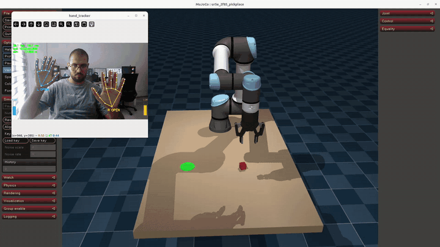
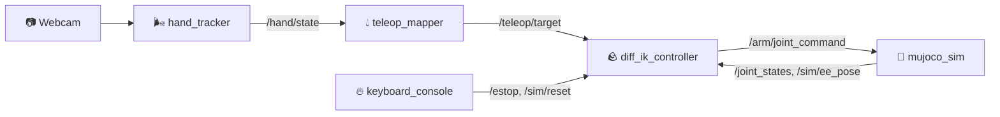

# 🌀 Hand Teleop

### *The ancient art of bending robot arms with your bare hands.*

> **Water. Earth. Fire. Air.**
> Long ago, robots could only be teleoperated by those who owned leader arms, VR rigs and
> haptic gloves. Then a humble webcam learned to read hands, and everything changed.



▶️ [Full demo video (27 s)](results/demo.mp4)

**Hand Teleop** lets you drive a robot arm with nothing but a webcam and your hands. Move your
right hand and the gripper follows. Pinch with your left and it grasps. Make a fist and the arm
holds still while you reposition. No extra hardware to buy. The reference setup bends a simulated
**UR5e + Robotiq 2F-85** in MuJoCo, and the hand-reading part is robot-agnostic.

| Proof of mastery (live, one operator) | |
| --- | --- |
| Pick-and-place | **20 / 20** |
| Camera → arm command latency | **62 ms** median (76 ms p95) |
| Jitter with the hand held still | **< 0.6 mm** |
| Tracking error | **5.1 mm** RMS |

Full numbers: [`results/RESULTS.md`](results/RESULTS.md).

---

## 🌍 The Four Nations (how it works)

| Element | Node | What it does |
| --- | --- | --- |
| 🌬️ **Air**, *reading the air* | `hand_tracker` | MediaPipe finds 21 landmarks per hand at 30 fps (up to 1080p); detects open palm, fist and pinch; shows a live camera window |
| 💧 **Water**, *go with the flow* | `hand_tracker` + `teleop_mapper` | One Euro filters smooth the jitter; the clutch re-anchors every time you open your palm, so the arm never jumps; speed limits keep motion fluid |
| 🪨 **Earth**, *metalbending* | `diff_ik_controller` (C++17) | Damped least-squares differential IK on MuJoCo Jacobians at 200 Hz, with singularity damping, nullspace posture, joint limits and a workspace guard. No MoveIt |
| 🔥 **Fire**, *control your fire* | `diff_ik_controller` + `teleop_console` | Latched keyboard e-stop (never a gesture), tracking-fault freeze, reset detection |



More detail in [`docs/design.md`](docs/design.md).

## 🧘 Why bend instead of buy?

Teleop hardware costs hundreds to thousands of dollars and lives on one bench. A webcam is
already on your laptop. Use Hand Teleop to:

- drive a simulated arm for demos, teaching and testing;
- prototype teleop interfaces before buying hardware;
- as a base for your own robot: `/teleop/target` is a plain Cartesian pose + gripper + clutch.

## 📜 Requirements

- Ubuntu 22.04 + **ROS 2 Humble**
- Python 3.10: `pip install -r requirements.txt` (MuJoCo 3.12, MediaPipe 1.0.1, OpenCV, NumPy < 2)
- Any USB webcam (MJPG recommended); the widest mode that holds 30 fps is picked automatically
- A GPU helps the simulator render, but is not required

## 🏯 Begin your training

```bash
git clone https://github.com/Hypothalmuss/hand-teleop.git && cd hand-teleop
source /opt/ros/humble/setup.bash
python3 -m pip install -r requirements.txt
colcon build --symlink-install && source install/setup.bash

# meditate in your own spirit world: keep other robots' topics out
export ROS_DOMAIN_ID=77 ROS_LOCALHOST_ONLY=1

python3 scripts/setup_hand_tracker.py      # once: raise your RIGHT hand
python3 scripts/calibrate_workspace.py     # ~30 s: hold the 9 poses shown on screen
ros2 launch hand_teleop_bringup teleop.launch.py console:=terminal
```

No webcam yet? Train with a spirit hand: `ros2 launch hand_teleop_bringup teleop.launch.py hand:=fake`.
Offline input: `video:=clip.mp4`. Hide the camera window: `window:=false`.

## 🌀 Bending forms

| Form | Effect |
| --- | --- |
| ✋ Right hand, open palm | The arm follows your hand |
| ✊ Right hand, fist (or out of view 0.3 s) | The arm holds; move your hand, open again to continue |
| 🤏 Left hand, thumb–index pinch | Close / open the gripper |
| `ESC` | 🔥 E-stop (latched) |
| `c` | Clear the e-stop, then open your palm to re-engage |
| `r` | Reset the scene (next seed) |

## 🐉 Wisdom of the masters (steady, accurate control)

- **Light is your ally.** Use bright, even light and no backlight. Mount the camera rigidly at chest height, 60–80 cm away.
- **Face the camera with your palm.** Tilting your palm reads as moving forward/back. Rest your elbow.
- **Use the clutch like lifting a mouse.** Stay in a small, comfortable area; fist, re-centre, open.
- **Be still before you strike.** Freeze the arm (right fist) before gripping with the left hand.
- **Recalibrate** when the camera, the bender or the chair changes.

## 🏆 Test your mastery

```bash
python3 scripts/live_session.py            # guided trial with on-screen prompts, logs everything
python3 scripts/analyze_live_session.py recordings/live_session --out results/live_session
python3 scripts/measure_latency.py --seconds 60
python3 scripts/teleop_benchmark.py        # 20 seeded pick-and-place attempts
scripts/record_demo_video.sh 60 results/my_demo.mp4
```

## 🗺️ Other lands (use it with another robot)

- **Another simulated arm:** `diff_ik_controller` takes `scene_path`, `arm_joints` and `tcp_site`
  parameters. Point them at your MJCF, then tune `config/ik.yaml` and the workspace box in
  `config/workspace.yaml`.
- **Your own controller or MoveIt Servo:** consume `/teleop/target`
  (`hand_teleop_msgs/TeleopTarget`). The mapper needs the current TCP pose on `sim/ee_pose`
  (remap it to your robot's pose topic).
- **Real hardware:** swap `mujoco_sim` for a driver that subscribes to `/arm/joint_command` and
  publishes `/joint_states`. **Not yet tested on hardware.** Bring your own safety layer, and see
  `docs/engineering_notes.md` about the servo's velocity feedforward.

## ⚙️ Configuration

Everything tunable lives in `config/`:

| File | Contents |
| --- | --- |
| `filters.yaml` | camera mode, One Euro filters, gesture thresholds, handedness, camera window |
| `workspace.yaml` | workspace box, calibrated hand ranges, axis mapping, gains, speed limits, gripper |
| `ik.yaml` | IK gains, damping, limits, home pose, feedforward, e-stop and reset thresholds |
| `rates.yaml` | loop rates |
| `task.yaml` | scene (table, cube, target), randomization, success thresholds |
| `seeds.txt` | scene seeds for resets and the benchmark |

## 🧭 Layout

```
config/                   all tunables
src/hand_tracker/         🌬️ webcam + MediaPipe tracking, filters, gestures, fake hand
src/teleop_mapper/        💧 hand -> TCP target, clutch, gripper
src/diff_ik_controller/   🪨 C++ differential IK controller
src/teleop_console/       🔥 keyboard console (e-stop, clear, reset)
src/mujoco_sim_ros/       🤖 MuJoCo simulator node
src/ur5e_2f85_mujoco/     MJCF assets, scene builder, kinematics (no ROS)
src/hand_teleop_msgs/     messages and services
src/hand_teleop_bringup/  launch files, RViz config
scripts/                  calibration, measurement, benchmark, recording
docs/                     design and engineering notes
results/                  measured results and demo video
```

## 🧪 Tests

```bash
colcon test --executor sequential && colcon test-result --verbose   # 60+ unit, gtest and launch tests
```

## 🌑 Limitations (even the Avatar had to learn)

- Position only: the gripper always points down (no wrist rotation yet).
- Depth comes from apparent palm size (no depth camera), so it is the noisiest axis.
- ~1 cm overshoot when the hand stops abruptly; being worked on.
- Measured with one operator in one session.

## 📚 Scrolls

- [`docs/design.md`](docs/design.md): architecture, topics, control law
- [`docs/engineering_notes.md`](docs/engineering_notes.md): why each non-obvious default is what it is
- [`results/RESULTS.md`](results/RESULTS.md): measured results

## 🙏 License and credits

MIT (`LICENSE`). The robot models come from [MuJoCo Menagerie](https://github.com/google-deepmind/mujoco_menagerie):
UR5e (BSD-3) and Robotiq 2F-85 (BSD-2). Hand tracking uses [MediaPipe](https://developers.google.com/mediapipe)
(Apache-2.0). See `THIRD_PARTY_LICENSES.md`.

<sub>Inspired by *Avatar: The Last Airbender*. Not affiliated with or endorsed by its creators.</sub>
