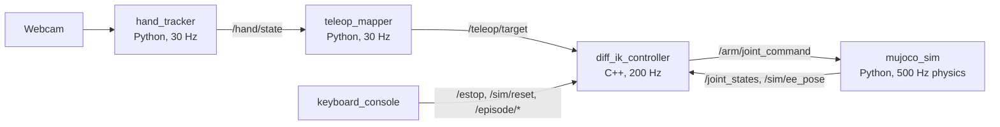

# Hand Teleop → Imitation Learning (UR5e + Robotiq 2F-85, MuJoCo, ROS 2)

Webcam hand teleoperation of a simulated UR5e + Robotiq 2F-85, used to record pick-and-place
demonstrations and train imitation-learning policies (ACT, Diffusion Policy). Simulation only,
live camera, real human input. The full plan is in [`docs/project_plan.md`](docs/project_plan.md).

> **Status:** phases 0–6 (teleop half) are implemented, tested and measured live
> (`results/live_session/report.md`). Webcam test clips are still to be recorded. Phases 7–10 (learning) and
> Docker come next. History is in `CHANGELOG.md`, and every deviation from the plan is recorded
> in `results/tuning_notes.md`.

## Architecture



- **hand_tracker**: MediaPipe HandLandmarker, One Euro filters, open/fist gestures (finger straightness, 3-frame debounce), pinch; `--video` offline mode.
- **teleop_mapper**: right-hand position → TCP target, with open-palm/fist clutch and relative re-anchoring (the arm never jumps); left pinch → gripper.
- **diff_ik_controller** (C++17): damped least-squares IK on MuJoCo Jacobians with singularity damping, nullspace posture, joint limits, workspace guard, latching e-stop and latency metrics. See its [README](src/diff_ik_controller/README.md) for the control law.
- **mujoco_sim**: real-time physics, 30 Hz cameras in a separate render thread, `/sim/reset`, `/sim/clock`. Joint commands go through a UR-`servoj`-like servo with velocity feedforward.

## Results so far

| Metric | Value | Target | Source |
| --- | --- | --- | --- |
| Scripted grasp-lift stability | 200 / 200 | ≥ 199 / 200 | `results/phase1_tests.txt` |
| Sim rates / real-time factor | 99.8 Hz joints, 29.8 Hz images, RTF 1.00 | 100 ± 5, 30 ± 3, ≥ 0.95 | `results/phase2_*.txt` |
| IK square tracking (10 cm @ 0.1 m/s) | 3.8 mm RMS | < 5 mm | `results/phase5_square_tracking.png` |
| Post-e-stop hold drift | 1.9e-4 rad | < 1e-3 rad | `results/phase5_tests.txt` |
| Hand tracker processing (live, 1080p) | p50 20 ms, p95 23 ms typical (3 of 95 windows > 40 ms, max 53) | p95 < 40 ms | `results/live_session/report.md` |
| Capture→command p50 / p95 (live, incl. camera) | 62 / 76 ms | < 120 / 200 ms | `results/latency.md` |
| Tracking error RMS (live, ≤ 0.2 m/s) | 5.1 mm | < 15 mm | `results/latency.md` |
| Teleop pick-and-place (live) | 20 / 20, median 25.9 s (23.0 s after practice) | ≥ 17 / 20, < 25 s | `results/teleop_benchmark.md` |

## Environment (recorded at phase 0)

| Item | Version |
| --- | --- |
| OS | Ubuntu 22.04 |
| ROS 2 | **Humble** (the plan's fallback distro; the dev machine runs 22.04) |
| Python | 3.10 |
| MuJoCo | 3.12.0 (pip wheel; also provides `libmujoco.so` and headers for the C++ IK node) |
| MediaPipe | 1.0.1 (Tasks API, bundled `hand_landmarker.task`) |
| numpy | 1.26.4 (< 2 for Humble's `cv_bridge`) |
| Dev CPU / GPU | AMD Ryzen 5 5600 / NVIDIA RTX 3050 |

`torch` and `lerobot` are pinned when the learning phases start.

## Quick start (native)

Isolate ROS from other robots on the network first (domain 0 is shared on this LAN):
`export ROS_DOMAIN_ID=77 ROS_LOCALHOST_ONLY=1`.

```bash
source /opt/ros/humble/setup.bash
python3 -m pip install -r requirements.txt
colcon build --symlink-install && source install/setup.bash
colcon test --executor sequential && colcon test-result --verbose
```

| What | Command |
| --- | --- |
| Handedness setup (once) | `python3 scripts/setup_hand_tracker.py` |
| Workspace calibration (< 60 s) | `python3 scripts/calibrate_workspace.py` |
| Live teleop (viewer on) | `ros2 launch hand_teleop_bringup teleop.launch.py` |
| Keyboard console | `ros2 run episode_recorder keyboard_console` (own terminal), or `console:=terminal` |
| Teleop without a webcam | `ros2 launch hand_teleop_bringup teleop.launch.py hand:=fake` |
| Offline hand input | `ros2 launch hand_teleop_bringup teleop.launch.py video:=clip.mp4` |
| Sim + scripted pick-and-place | `ros2 launch hand_teleop_bringup sim.launch.py viewer:=true scripted:=pick_place episodes:=3` |
| Sim + IK only | `ros2 launch hand_teleop_bringup ik_sim.launch.py viewer:=true` |

A camera window with the hand overlay opens with teleop (`window:=false` to disable). The
webcam runs at its widest 30 fps mode (`camera.width: max` in `config/filters.yaml`). Re-run
`calibrate_workspace.py` whenever the camera mode or position changes.

Console keys: `ESC` e-stop (latched), `c` clear, `r` reset to the next seed, `space`
start/stop episode, `d` discard, `s` mark success. Clutch: **open right palm = engaged,
fist = hold**. The left thumb–index pinch drives the gripper.

Rebuild the MuJoCo scene after changing `config/task.yaml` or the assets:
`python3 -m ur5e_2f85_mujoco.build_scene` (writes the committed `scene.xml` + `model_names.yaml`).
RViz (`rviz:=true`) shows the UR5e model when `ros-humble-ur-description` is installed.

## Operator checklist

These need a person and a webcam. Each script writes its evidence to the repo.

1. `python3 scripts/setup_hand_tracker.py` → sets `swap_handedness` in `config/filters.yaml`.
2. `python3 scripts/record_test_clips.py` → three 10 s clips + ground truth in
   `src/hand_tracker/test/data/`; then `colcon test --packages-select hand_tracker` runs the clip tests.
3. Screenshot of the overlay with both hands labelled → `results/phase3_overlay.png`.
4. `python3 scripts/calibrate_workspace.py` → `config/workspace.yaml` ranges.
5. 30 s bag of live teleop targets: `ros2 bag record -s mcap -o results/phase4_teleop_target /teleop/target /teleop/target_marker`.
6. Live latency: `python3 scripts/measure_latency.py --seconds 60` during teleop → `results/latency.{csv,md}`.
7. Tuning pass: adjust `config/filters.yaml` / `workspace.yaml` / `ik.yaml`, one line per change in `results/tuning_notes.md`.
8. Benchmark: `python3 scripts/teleop_benchmark.py` (20 seeded attempts) → `results/teleop_benchmark.{csv,md}`.
9. Demo video: `scripts/record_demo_video.sh 60 results/demo_v1.mp4` (split screen, one pick-and-place, then an e-stop).

## Layout

```
config/                   every rate, gain, range, threshold and seed list (single source of truth)
src/hand_teleop_msgs/     messages and services
src/ur5e_2f85_mujoco/     MJCF assets (Menagerie), scene builder, kinematics oracle, shared task logic (no ROS)
src/mujoco_sim_ros/       simulator node, scripted trajectories
src/hand_tracker/         MediaPipe tracking node, filters, gestures, fake hand
src/teleop_mapper/        hand → TCP target mapping node
src/diff_ik_controller/   C++ differential IK controller
src/episode_recorder/     keyboard console (recorder: phase 7)
src/hand_teleop_bringup/  launch files, RViz config; installs config/ for every node
scripts/                  calibration, measurement, benchmark and recording tools
results/                  committed evidence referenced by this README
```

## Scene notes

- `base_link` is the MuJoCo world frame: x toward the table, y left, z up.
- The TCP site sits on the gripper base +z axis at the midpoint of the closed finger pads
  (0.1547 m from the flange).
- The UR5e joints use `gravcomp` + `actuatorgravcomp`, which models the gravity compensation
  the real UR controller does internally.
- The home keyframe is `[π, −π/2, π/2, −π/2, −π/2, 0]`. The plan's `pan = 0` puts the TCP
  behind the base.

## Licenses

Our code is MIT (`LICENSE`). Third-party models keep their licenses: UR5e MJCF (BSD-3) and
Robotiq 2F-85 MJCF (BSD-2) from MuJoCo Menagerie (Apache-2.0 changes), and the MediaPipe hand
landmarker model (Apache-2.0). See `THIRD_PARTY_LICENSES.md`.
