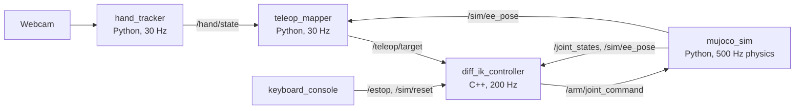

# Design

## Pipeline

| Node | Package | Role |
| --- | --- | --- |
| `hand_tracker` | `hand_tracker` | MediaPipe HandLandmarker (21 landmarks per hand), One Euro filters, open/fist and pinch features, camera window |
| `teleop_mapper` | `teleop_mapper` | Right hand → TCP target with open-palm/fist clutch and relative re-anchoring; left pinch → gripper |
| `diff_ik_controller` | `diff_ik_controller` (C++17) | Damped least-squares differential IK on MuJoCo Jacobians, limits, workspace guard, latching e-stop, latency metrics |
| `mujoco_sim` | `mujoco_sim_ros` | UR5e + 2F-85 physics, cameras, scene reset, sim clock |
| `keyboard_console` | `teleop_console` | ESC e-stop, clear, scene reset |

The robot-independent part is `hand_tracker` + `teleop_mapper`. Their output, `/teleop/target`, is a
Cartesian pose in `base_link` plus a gripper value and a clutch flag. Anything that can servo a
Cartesian target can consume it.

## Control scheme

- **Right hand = TCP position.** Open palm = engaged, fist = arm holds (clutch). The hand is
  mapped from a calibrated image/depth range onto a workspace box, relative to where it was
  when you engaged, so the arm never jumps. Image x → robot y, image y → robot z, apparent
  palm size → robot x.
- **Left hand = gripper.** Thumb–index pinch distance → aperture 0..1.
- **Keyboard = safety.** ESC is a latched e-stop, cleared only by an explicit clear. Safety is
  never a gesture.
- Orientation is fixed (gripper pointing down).

## Topics

| Topic | Type | Rate |
| --- | --- | --- |
| `/hand/state` | `hand_teleop_msgs/HandState` | 30 Hz |
| `/hand/debug_image` | `sensor_msgs/Image` | 30 Hz (when subscribed) |
| `/teleop/target` | `hand_teleop_msgs/TeleopTarget` | 30 Hz |
| `/arm/joint_command` | `hand_teleop_msgs/JointCommand` | 200 Hz |
| `/joint_states` | `sensor_msgs/JointState` | 100 Hz |
| `/sim/ee_pose` | `geometry_msgs/PoseStamped` | 100 Hz |
| `/sim/front/image`, `/sim/wrist/image` | `sensor_msgs/Image` | 30 Hz |
| `/sim/object_poses` | `hand_teleop_msgs/ObjectPoses` | 30 Hz |
| `/sim/clock` | `rosgraph_msgs/Clock` | 100 Hz (all nodes use sim time) |
| `/estop` | `std_msgs/Bool`, transient local | on change |
| `/metrics/latency` | `hand_teleop_msgs/LatencySample` | per target |

Services: `/sim/reset` (`ResetScene`), `/estop/clear` (`std_srvs/Trigger`).

`capture_stamp` is set once, at camera capture (backdated by the V4L2 frame age), and copied
unchanged through every message. That single field is how end-to-end latency is measured.

## IK control law

1. `v = clamp(v_ff + Kp_pos (p_target − p_tcp), v_max)`, `w = clamp(Kp_rot · rotvec(R_target R_tcpᵀ), w_max)`
2. `dq = Jᵀ (J Jᵀ + λ² I)⁻¹ [v; w] + (I − J⁺J) k_null (q_home − q)` (J⁺ truncated at σ_thresh)
3. `λ² = λ₀² + (1 − σ_min/σ_thresh)² λ_max²` when `σ_min < σ_thresh`
4. Uniform scaling to `|dq_i| ≤ qd_max`, no motion into joint limits, workspace guard
5. `q_cmd += dq·dt`, resynced to the measured joints on engage, e-stop clear and external resets

All parameters live in `config/*.yaml`. Non-obvious choices and their measurements are in
[`engineering_notes.md`](engineering_notes.md).
