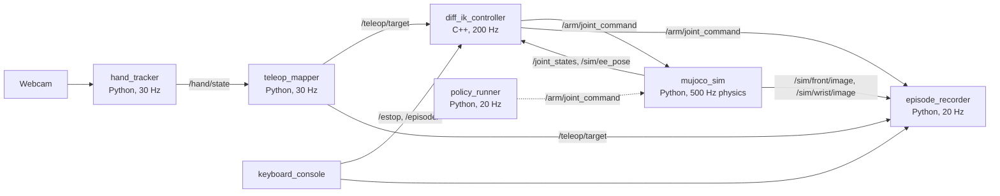

# Hand Teleop to Imitation Learning: UR5e Project Plan

Sep 25, 2026 · @robotic

## 1. Project overview

Build a webcam hand-teleoperation system for a simulated UR5e + Robotiq 2F-85 arm, use it to record pick-and-place demonstrations, and train an imitation-learning policy that performs the task autonomously. The project is simulation-only (MuJoCo) with a live camera and real human input, and every interface is designed so a real UR arm could replace the simulator without code changes above the driver.

**Control scheme.** Right hand = end-effector position (plus a clutch gesture). Left hand = gripper aperture via thumb–index pinch. Keyboard = e-stop, episode start/stop, reset.

**Deliverables (definition of done)**

1. A ROS 2 workspace with the packages in section 4, building with `colcon build` and passing `colcon test` on a clean machine.
2. A MuJoCo scene of UR5e + 2F-85 + table + cube + target, grasping stable (no jitter or ejection) over 200 scripted grasp-lift cycles.
3. Live teleop: hand movement to arm movement with measured end-to-end latency (target p50 < 120 ms, p95 < 200 ms) and reported tracking error.
4. A dataset of at least 150 successful teleop demonstrations in LeRobotDataset format, with metadata (seed, initial cube pose, duration, success).
5. Two trained policies (ACT, Diffusion Policy) evaluated over 100 randomized episodes each, with success rates reported in-distribution and out-of-distribution.
6. Ablation results: demo count (25 / 50 / 100 / 150) and with/without wrist camera.
7. README with architecture diagram, results tables, a 60–90 s demo video, Dockerfile, CI, and license file.

**Non-goals.** No real robot hardware, no depth camera, no learned hand pose model of our own, no MoveIt (differential IK is written from scratch in C++ to show control competence).

**Time budget.** About 10–12 weeks part-time. Phases 0–6 (teleop) roughly 5 weeks, phases 7–9 (learning) roughly 4 weeks, phase 10 about 1 week.

## 2. Fixed decisions

These are settled. The agent does not revisit them without asking.

| Decision | Choice | Why |
| --- | --- | --- |
| Robot | Universal Robots UR5e + Robotiq 2F-85 | Both ship in [MuJoCo Menagerie](https://github.com/google-deepmind/mujoco_menagerie) as tuned MJCF with meshes (`universal_robots_ur5e`, `robotiq_2f85`). UR3e is not in Menagerie; UR5e is the same family as the existing UR3e project. Licenses: UR5e model BSD-3, 2F-85 model BSD-2, Menagerie changes Apache-2.0. Keep the LICENSE files next to the copied models. |
| URDF (for RViz and tf only) | [Universal\_Robots\_ROS2\_Description](https://github.com/UniversalRobots/Universal_Robots_ROS2_Description) (BSD-3) + a Robotiq 2F-85 description package (BSD) | Open-source meshes and URDF; used only for visualization, never for physics. |
| Simulator | MuJoCo ≥ 3.2, Python bindings (`pip install mujoco`) | Stable contacts for grasping, fast headless rendering (EGL), MjSpec `attach` for composing arm + gripper. |
| Physics timestep | 0.002 s, `integrator=implicitfast` | Standard for Menagerie arms. |
| Middleware | ROS 2 Jazzy on Ubuntu 24.04 (fallback: Humble on 22.04 if that is the machine you have) | One distro only; choose at phase 0 and record it in the README. |
| Languages | Python 3 for hand tracking, sim node, teleop mapping, recorder, policy runner. C++17 for the differential IK controller. | C++ on the real-time-critical node closes the CV gap and is a fair engineering choice. |
| Hand tracking | MediaPipe Tasks `HandLandmarker` (21 landmarks per hand, handedness) | Off-the-shelf, CPU-only, 30 fps on a laptop. |
| Filtering | One Euro filter on landmarks | Standard for low-latency, low-jitter pose input. |
| IK | Damped least-squares differential IK with nullspace posture task, written from scratch with MuJoCo's `mj_jacSite` | No MoveIt. The node loads the same MJCF as the sim to compute Jacobians. |
| Base frame | `base_link`: x forward toward the table, y left, z up. TCP site `tcp` between the fingertips, gripper pointing down (-z) in the home pose. | Matches UR convention. |
| Hand-to-robot mapping (v1) | Right hand: mirrored image x → robot y, image y (up) → robot z, hand apparent size → robot x (closer to webcam = farther from base). Orientation fixed pointing down. Left hand: thumb–index pinch → gripper aperture 0..1. | Orientation control is an optional extension, not v1. |
| Clutch | Right hand open palm = engaged; right hand fist = disengaged (arm holds). No right hand for 0.3 s = hold. | Reliable gestures only. E-stop is a keyboard key, never a gesture. |
| Task | Pick one cube (3 cm, 50 g) from a randomized 20 × 20 cm region and place it on a target disc (8 cm) on the table | One task, done well, with numbers. |
| Dataset format | LeRobotDataset (version of the installed `lerobot` at implementation time) | Native to ACT and Diffusion Policy trainers. |
| Policy action space | Absolute joint position targets (6) + gripper (1) at 20 Hz | ACT standard; the policy replaces the IK node's output, nothing else changes. |
| Camera resolution | Sim cameras rendered 256 × 256, policy input 224 × 224 (resize in trainer) | Cheap and standard. |
| Rates | Webcam 30 Hz · hand + mapping 30 Hz · IK 200 Hz · physics 500 Hz · joint\_states 100 Hz · sim images 30 Hz · recorder 20 Hz · policy 20 Hz (action chunking) | Written once here; every node reads its rate from `config/rates.yaml`. |
| License | MIT for our code; third-party model licenses preserved |  |

## 3. System architecture

Six ROS 2 nodes form a chain from webcam to simulator; the policy runner later replaces the three human-input nodes with no change downstream.



During data collection the recorder subscribes to what the IK node actually sent; during evaluation `policy_runner` publishes on the same topic and the IK node is not launched.

**Topics**

| Topic | Type | Publisher | Rate | Content |
| --- | --- | --- | --- | --- |
| `/hand/state` | `hand_teleop_msgs/HandState` | hand\_tracker | 30 Hz | Both hands: presence, 21 × 3 landmarks (normalized), palm scale, pinch ratio, open/fist flags, `capture_stamp` |
| `/hand/debug_image` | `sensor_msgs/Image` | hand\_tracker | 30 Hz | Mirrored webcam frame with skeleton overlay |
| `/teleop/target` | `hand_teleop_msgs/TeleopTarget` | teleop\_mapper | 30 Hz | EE target pose in `base_link`, gripper 0..1, `engaged`, `capture_stamp` |
| `/arm/joint_command` | `hand_teleop_msgs/JointCommand` | diff\_ik\_controller or policy\_runner | 200 / 20 Hz | 6 joint position targets (rad), gripper 0..1, `capture_stamp` passthrough |
| `/joint_states` | `sensor_msgs/JointState` | mujoco\_sim | 100 Hz | 6 arm joints + `finger_joint` position and velocity |
| `/sim/ee_pose` | `geometry_msgs/PoseStamped` | mujoco\_sim | 100 Hz | Ground-truth TCP pose in `base_link` |
| `/sim/front/image`, `/sim/wrist/image` | `sensor_msgs/Image` (rgb8) | mujoco\_sim | 30 Hz | 256 × 256 renders |
| `/sim/object_poses` | `hand_teleop_msgs/ObjectPoses` | mujoco\_sim | 30 Hz | Ground-truth cube and target poses (eval and success detection only) |
| `/sim/clock` | `rosgraph_msgs/Clock` | mujoco\_sim | 100 Hz | All nodes run with `use_sim_time:=true` |
| `/estop` | `std_msgs/Bool` (transient local) | keyboard\_console | on change | Latched; cleared only by explicit service call |
| `/metrics/latency` | `hand_teleop_msgs/LatencySample` | diff\_ik\_controller | 30 Hz | Per-frame stamps: capture, hand, target, command, applied |

**Services**: `/sim/reset` (`hand_teleop_msgs/ResetEpisode`: `int64 seed`, `bool randomize_target` → cube pose, target pose), `/estop/clear` (`std_srvs/Trigger`), `/episode/start`, `/episode/stop` (`hand_teleop_msgs/EpisodeControl`: `bool success`, `bool discard`).

**Message definitions** (package `hand_teleop_msgs`)

```markdown
Hand.msg
  bool present
  float64[63] landmarks        # 21 x (x, y, z), MediaPipe normalized image coords, mirrored
  float64 palm_scale           # wrist (0) to middle_mcp (9) distance, normalized units
  float64 pinch                # thumb_tip(4)-index_tip(8) distance / palm_scale
  bool is_open
  bool is_fist

HandState.msg
  std_msgs/Header header
  builtin_interfaces/Time capture_stamp
  Hand left
  Hand right
  float32 fps

TeleopTarget.msg
  std_msgs/Header header       # frame_id = base_link
  builtin_interfaces/Time capture_stamp
  geometry_msgs/Pose ee_target
  float64 gripper              # 0 closed .. 1 open
  bool engaged

JointCommand.msg
  std_msgs/Header header
  builtin_interfaces/Time capture_stamp
  float64[6] positions
  float64 gripper

ObjectPoses.msg
  std_msgs/Header header
  geometry_msgs/Pose cube
  geometry_msgs/Pose target

LatencySample.msg
  builtin_interfaces/Time capture_stamp
  builtin_interfaces/Time hand_stamp
  builtin_interfaces/Time target_stamp
  builtin_interfaces/Time command_stamp
  float64 tracking_error_m
```

`capture_stamp` is set once by the hand tracker from the camera frame and copied unchanged through every message. That single field is how end-to-end latency is measured.

## 4. Repository layout

One git repository, one colcon workspace, seven ROS 2 packages plus a top-level `learning/` directory for training code that does not need ROS.

```markdown
hand-teleop-il/
├── README.md
├── LICENSE                        # MIT (our code)
├── THIRD_PARTY_LICENSES.md        # Menagerie, UR, Robotiq
├── Dockerfile                     # ROS 2 Jazzy + MuJoCo + MediaPipe + lerobot
├── docker-compose.yml             # webcam and X11 passthrough
├── .github/workflows/ci.yml       # colcon build + colcon test + pytest learning/
├── config/
│   ├── rates.yaml                 # every loop rate, single source of truth
│   ├── workspace.yaml             # robot workspace box, hand-to-robot mapping gains
│   ├── ik.yaml                    # damping, gains, limits, nullspace posture
│   ├── filters.yaml               # One Euro parameters per landmark group
│   └── task.yaml                  # cube size/mass, randomization ranges, success thresholds
├── src/
│   ├── hand_teleop_msgs/          # .msg / .srv only
│   ├── ur5e_2f85_mujoco/          # MJCF assets + scene builder + tests (no ROS deps)
│   │   ├── assets/universal_robots_ur5e/   (copied from Menagerie, LICENSE kept)
│   │   ├── assets/robotiq_2f85/            (copied from Menagerie, LICENSE kept)
│   │   ├── ur5e_2f85_mujoco/build_scene.py # MjSpec composition → scene.xml
│   │   ├── ur5e_2f85_mujoco/scene.xml      # generated, committed
│   │   └── test/test_scene.py
│   ├── mujoco_sim_ros/            # Python: simulation node, cameras, reset service
│   ├── hand_tracker/              # Python: MediaPipe, filters, gesture classifier
│   ├── teleop_mapper/             # Python: gestures → EE target + gripper + clutch
│   ├── diff_ik_controller/        # C++: differential IK, safety, latency metrics
│   ├── episode_recorder/          # Python: LeRobotDataset writer, keyboard console
│   ├── policy_runner/             # Python: loads checkpoint, publishes joint commands
│   └── hand_teleop_bringup/       # launch files, RViz config, URDF for visualization
├── learning/
│   ├── train_act.sh / train_dp.sh # lerobot CLI wrappers with pinned hyperparameters
│   ├── eval/run_eval.py           # drives /sim/reset + policy_runner over N seeds
│   ├── eval/report.py             # results tables and plots
│   └── tests/
├── scripts/
│   ├── calibrate_workspace.py     # hand-corner calibration wizard
│   ├── measure_latency.py         # reads /metrics/latency, prints p50/p95
│   └── record_demo_video.sh
└── results/                       # committed CSVs and plots referenced by README
```

Rules: no ROS dependency inside `ur5e_2f85_mujoco` or `learning/` so they can be tested with plain `pytest`; every node reads parameters from `config/*.yaml` through launch arguments; no hard-coded topic names outside `hand_teleop_bringup`.

## 5. Phase 0: Environment and repo setup (2–3 days)

Goal: a clean machine can clone the repo, build it, and run a smoke test in under 15 minutes.

**Tasks**

1. Create the repo with the layout in section 4, MIT `LICENSE`, `.gitignore` (build/, install/, log/, datasets/, checkpoints/), `.pre-commit-config.yaml` (ruff, black, clang-format).
2. Install ROS 2 (Jazzy on Ubuntu 24.04). Record the exact distro in `README.md` and in `config/rates.yaml` as a comment.
3. Python environment: `mujoco>=3.2`, `mediapipe` (Tasks API), `numpy`, `opencv-python`, `scipy`, `pyyaml`, `torch`, `lerobot` (pin the version in `requirements.txt` after the first successful install; write it down).
4. C++ dependencies: MuJoCo C library (download the matching release tarball into `third_party/mujoco/`, or `find_package` if installed system-wide), Eigen3, `rclcpp`, `ament_cmake_gtest`.
5. Clone MuJoCo Menagerie and copy `universal_robots_ur5e/` and `robotiq_2f85/` (with their `LICENSE` files) into `src/ur5e_2f85_mujoco/assets/`. Add both licenses to `THIRD_PARTY_LICENSES.md`.
6. Write `Dockerfile` and `docker-compose.yml` with `/dev/video0` passthrough and X11 for the MuJoCo viewer. Verify the webcam is visible inside the container.
7. CI: GitHub Actions job on `ubuntu-24.04` that runs `colcon build`, `colcon test`, and `pytest learning/ src/ur5e_2f85_mujoco`. Rendering tests use `MUJOCO_GL=egl`.
8. Create `hand_teleop_msgs` with the messages and services from section 3 and build it; every other package depends on it.

**Acceptance**

- `colcon build --symlink-install` succeeds from a clean clone inside the Docker image.
- `python -c "import mujoco, mediapipe, lerobot"` succeeds in the same environment.
- `ros2 interface show hand_teleop_msgs/msg/TeleopTarget` prints the definition.
- CI is green on the first commit.

## 6. Phase 1: Robot model and scene in MuJoCo (4–5 days)

Goal: `scene.xml` with UR5e + 2F-85 + table + cube + target, grasp-stable, with two cameras, and a pytest suite proving it. No ROS in this phase.

**Tasks**

1. `build_scene.py`: load `assets/universal_robots_ur5e/ur5e.xml` and `assets/robotiq_2f85/2f85.xml` as `mujoco.MjSpec`, attach the gripper's root body to the arm's flange site (`attachment_site` in the Menagerie UR5e) with prefix `2f85/`. Fallback if `attach` misbehaves: hand-written XML with `<include>` and manual prefixing. Output `scene.xml`; commit it.
2. Add a `tcp` site on the gripper base body, on the flange +z axis, between the finger pads when closed (start at 0.13 m, verify in the viewer). All IK and all reported EE poses use this site.
3. World: robot base at the origin on a table slab (top surface z = 0, 1.2 × 0.8 m). Cube: free joint, half-size 0.015 m, mass 0.05 kg, `friction="1 0.005 0.0001"`, `priority="1"`, `condim="4"`, red. Target: visual-only cylinder (radius 0.04, `contype="0" conaffinity="0"`), green, default position (0.45, -0.20, 0.001). Cube spawn region: x ∈ \[0.35, 0.55\], y ∈ \[0.05, 0.25\], yaw ∈ \[-π, π\]. Ranges live in `config/task.yaml`.
4. Options: `timestep="0.002"`, `integrator="implicitfast"`, `cone="elliptic"`, `impratio="10"` (the Menagerie 2F-85 scene uses these). Keep the Menagerie actuators: six position actuators for the arm; the gripper's single `fingers_actuator` (ctrl 0..255).
5. Cameras: `front` (fixed, at about (1.1, 0.0, 0.7) looking at (0.45, 0.0, 0.05), fovy 45) and `wrist` (child of the gripper base body, looking along +z between the fingers, fovy 60). Two lights with shadows.
6. Keyframe `home`: arm `[0, -1.5708, 1.5708, -1.5708, -1.5708, 0]`, gripper open, cube at the region center. Verify the TCP points down (-z) at home.
7. `model_names.yaml`: joint names, actuator names, site names, camera names, gripper joint range (`right_driver_joint` 0..0.8 rad in Menagerie; verify), and the mapping `gripper_cmd 0..1 → ctrl = (1 - cmd) * 255`. Every later node reads names from this file, never hard-codes them.
8. `kinematics.py` (pure MuJoCo, no ROS): `fk(q) → tcp pose`, `jacobian(q) → 6×6`, and a simple Python DLS IK used only by tests and scripted demos. The C++ node re-implements this; the Python version is the reference oracle.
9. Contact tuning loop: scripted grasp of the cube at 50 random poses in the viewer. Adjust cube `solref`/`solimp` and gripper pad friction until nothing jitters, slips, or ejects.

**Tests** (`test/test_scene.py`, headless with `MUJOCO_GL=egl`)

- Model loads in < 1 s; expected joint, actuator, site, and camera names exist.
- Home keyframe held for 2 s under position control: max joint drift < 1e-3 rad, TCP within 1 cm of the value recorded in `model_names.yaml`.
- Scripted grasp-lift over 200 random cube poses: after closing and lifting 10 cm and holding 2 s, cube z > 0.08 m and cube speed < 0.02 m/s in ≥ 199 of 200 runs.
- Offscreen render of both cameras returns 256 × 256 × 3 uint8 with non-zero variance.
- Determinism: same seed → identical `qpos` after 1000 steps.
- Python FK matches MuJoCo site pose to 1e-6 for 100 random joint configurations within limits.

**Acceptance**: all tests green in CI; a 20 s viewer clip of a scripted grasp saved to `results/phase1_grasp.mp4`.

## 7. Phase 2: Simulation ROS 2 node (3–4 days)

Goal: `mujoco_sim` node that steps physics in real time, exposes the topics and services in section 3, and can be driven by a scripted joint trajectory.

**Design**

- Package `mujoco_sim_ros`, node `mujoco_sim` (rclpy). One physics thread runs `mj_step` 5 times per 10 ms tick (500 Hz physics, 100 Hz control). A second thread renders both cameras at 30 Hz from a copied `mjData` snapshot so rendering never stalls physics. Optional `--viewer` flag opens `mujoco.viewer.launch_passive` for debugging.
- Publishes `/sim/clock`; the node runs a wall-clock loop but every stamp is sim time. All nodes launch with `use_sim_time:=true`.
- Subscribes `/arm/joint_command`. The latest message is held; each control tick writes `ctrl[0:6] = positions` and `ctrl[6] = (1 - gripper) * 255`. Missing commands for > 0.5 s: hold the last command (never fall to zero torque).
- Joint command sanity: clamp to joint limits and to a max step of `max_joint_step_rad` per tick (from `config/ik.yaml`); log a warning counter when clamping happens.
- Publishes `/joint_states` (100 Hz), `/sim/ee_pose` (100 Hz, `tcp` site), `/sim/object_poses` (30 Hz), `/sim/front/image` and `/sim/wrist/image` (30 Hz, rgb8, with `header.stamp` = sim time of the render).
- Service `/sim/reset(seed, randomize_target)`: seeds `numpy`, resets to the `home` keyframe, places the cube in the spawn region and (optionally) the target in its own region, runs 100 settle steps, returns both poses. While resetting, publishes nothing on the image topics.
- Broadcasts `tf`: `world → base_link` (static) and `base_link → tcp` (from `/sim/ee_pose`).

**Tasks**

1. Implement the node with parameters from `config/rates.yaml` and `config/task.yaml`.
2. `scripted_trajectory.py`: publishes a smooth joint-space sine sweep and a scripted pick-and-place (using the Python IK oracle) on `/arm/joint_command`.
3. Launch file `sim.launch.py` with args `viewer`, `headless`, `seed`.
4. `hand_teleop_bringup/rviz/sim.rviz`: RobotModel from the UR5e URDF + a gripper URDF, `tf`, both image panels. RViz is optional for development; it must not be a dependency for tests.

**Tests** (launch tests with `launch_testing`)

- Node starts headless, `/joint_states` rate 100 ± 5 Hz and image topics 30 ± 3 Hz measured over 5 s.
- Sine sweep: joint positions track commands with < 0.02 rad RMS error after the first second.
- Scripted pick-and-place succeeds (cube within 3 cm of the target) in 10 of 10 seeded runs.
- `/sim/reset` with the same seed twice returns identical cube poses; different seeds differ.
- Real-time factor ≥ 0.95 with rendering on, on the development laptop (record the CPU model in `results/phase2_rtf.txt`).

**Acceptance**: tests green; `ros2 launch hand_teleop_bringup sim.launch.py viewer:=true` shows the arm executing the scripted pick-and-place.

## 8. Phase 3: Hand tracking node (3–4 days)

Goal: `hand_tracker` node publishing filtered landmarks, palm scale, pinch, and open/fist flags for both hands at 30 Hz, with a debug overlay and an offline video mode for tests.

**Design**

- MediaPipe Tasks `HandLandmarker` (`hand_landmarker.task` bundled in the package), `num_hands=2`, running mode VIDEO with monotonically increasing timestamps, detection and tracking confidence 0.5.
- Capture thread: OpenCV, 640 × 480, MJPG, 30 fps, buffer size 1 (drop stale frames). `capture_stamp = node clock at frame read`. Frames are mirrored horizontally before inference so the image behaves like a mirror.
- Handedness: MediaPipe assumes a mirrored (selfie) input, so labels may be swapped after our flip. `config/filters.yaml` has `swap_handedness: bool`; the setup script asks the user to raise their right hand and sets it. Never trust a hard-coded assumption.
- Features per hand (all in normalized image units, using landmark indices 0 = wrist, 4 = thumb tip, 5/9/13/17 = finger MCPs, 8/12/16/20 = finger tips):
  - `palm_scale = ‖p9 − p0‖` (rigid regardless of finger pose; this is the depth proxy)
  - `pinch = ‖p4 − p8‖ / palm_scale`
  - `extension_k = ‖tip_k − mcp_k‖ / palm_scale` for index, middle, ring, pinky
  - `is_open` = all four `extension_k > 1.3`; `is_fist` = all four `extension_k < 0.9`; between = neither. Each flag needs 3 consecutive frames to change (debounce). Thresholds in `config/filters.yaml`.
- Filtering: One Euro filter per landmark coordinate (`min_cutoff=1.0`, `beta=0.007`, `d_cutoff=1.0`) and a heavier One Euro on `palm_scale` (`min_cutoff=0.5`). Parameters in `config/filters.yaml`. Raw values kept in a `debug` field when `publish_raw:=true`.
- A hand missing for 5 consecutive frames → `present=false`; its filter state resets on reappearance.
- Publishes `/hand/state` and `/hand/debug_image` (skeleton, handedness label, pinch bar, OPEN/FIST tag, fps, ms from capture to publish).
- Offline mode: `--video path` replaces the webcam and uses the file's frame timestamps. Used by tests and for reproducing bugs.

**Tasks**

1. Implement `one_euro.py` (vectorized over N × 3 landmarks) and `gestures.py` (pure functions on landmark arrays). No ROS in these two files.
2. Implement the node, overlay, and the `--video` mode.
3. Record three 10 s test clips at 480p into `test/data/`: right-hand open-palm sweep across the frame; left-hand pinch open/close 5 times; right-hand fist/open toggle 5 times. Write a small JSON of ground truth next to each (handedness, number of toggles).
4. `scripts/setup_hand_tracker.py`: shows the debug image, asks the user to raise the right hand, writes `swap_handedness`.

**Tests**

- `one_euro.py`: step input settles within 10 samples; constant input passes through unchanged; output lag on a 1 Hz sine at 30 Hz sampling < 3 samples.
- `gestures.py`: synthetic open and fist landmark sets classify correctly; debounce blocks single-frame flips.
- On the test clips: handedness matches ground truth in ≥ 95 % of frames with a hand present; pinch crosses 0.5 exactly 10 times (5 open/close pairs) ± 1; fist/open flag toggles 10 times ± 1.
- Processing latency (frame read → publish) p95 < 40 ms on the development laptop CPU; recorded in `results/phase3_latency.txt`.

**Acceptance**: tests green; a screenshot of the overlay with both hands labelled saved to `results/phase3_overlay.png`.

## 9. Phase 4: Teleop mapping node (2–3 days)

Goal: `teleop_mapper` turns `/hand/state` into a clamped end-effector target, a gripper value, and an engaged flag, with a clutch that never makes the arm jump.

**Design**

- Input axes from the right hand: `u` = mirrored normalized image x of landmark 9, `v` = 1 − normalized image y of landmark 9 (so up is positive), `d = 1 / palm_scale` (grows with distance from the webcam). Each axis is mapped linearly from its calibrated range to the robot workspace box, then clamped.
- Workspace box in `base_link` (`config/workspace.yaml`): x ∈ \[0.30, 0.60\], y ∈ \[−0.30, 0.30\], z ∈ \[0.02, 0.35\]. Axis mapping: `u → y`, `v → z`, `d → x` (hand closer to the webcam = TCP farther from the base). Sign flips are config values.
- Clutch (relative re-anchoring): `engaged` becomes true when the right hand is present and `is_open`, false when `is_fist` or absent for 0.3 s or when `/estop` is true. On the false→true edge, store `anchor_hand` (mapped hand position) and `anchor_ee` (current `/sim/ee_pose`). While engaged, `target = clamp(anchor_ee + gain ⊙ (mapped − anchor_hand), box)` with per-axis `gain` (default 1.0). While disengaged, keep publishing the last target with `engaged=false`.
- Target speed limit before IK: 0.5 m/s (config). Orientation: constant quaternion, gripper pointing −z, taken from the home pose.
- Gripper: `gripper = clamp((pinch − pinch_closed) / (pinch_open − pinch_closed), 0, 1)`, defaults `pinch_closed=0.25`, `pinch_open=1.0`, rate-limited to 2.0 per second. Left hand absent → hold the last value.
- Publishes `/teleop/target` on every `/hand/state` and a `visualization_msgs/Marker` sphere at the target for RViz. `capture_stamp` is copied from the input message.

**Tasks**

1. `mapping.py`: pure functions (`hand_to_workspace`, `reanchor`, `gripper_from_pinch`); no ROS.
2. The node, reading `config/workspace.yaml` and subscribing to `/hand/state`, `/sim/ee_pose`, `/estop`.
3. `scripts/calibrate_workspace.py`: guides the user to hold an open right hand at center, left, right, top, bottom, near, far (2 s each), records `u`, `v`, `d` ranges and the left hand's pinch range, writes `config/workspace.yaml`. Must run in under 60 s.

**Tests**

- Mapping: the four box corners of the calibrated range map exactly to the workspace box corners; inputs outside the range clamp.
- Re-anchoring: a synthetic hand jump of 0.3 in `u` while disengaged, then engaging, produces a target within 1 mm of the current EE pose on the first engaged frame.
- Speed limit: a synthetic 1 m instant hand jump yields a target trajectory of ≤ 0.5 m/s.
- Gripper: pinch ramp 0.2 → 1.1 over 0.1 s yields a gripper ramp limited to 2.0/s; left hand absent holds the value.
- E-stop: `/estop` true forces `engaged=false` within one message.

**Acceptance**: tests green; a 30 s bag file (`results/phase4_teleop_target.mcap`) recorded from live hands showing a smooth target path in RViz.

## 10. Phase 5: Differential IK controller in C++ (5–6 days)

Goal: `diff_ik_controller` (C++17, rclcpp, Eigen, MuJoCo C API) converts the Cartesian target into joint position commands at 200 Hz with singularity damping, joint-limit handling, a latching e-stop, and latency metrics. This is the CV's C++ showpiece; keep the math in a plain class with no ROS so it can be unit-tested with gtest.

**Design**

- Kinematics: the node loads the same `scene.xml` as the simulator and keeps its own `mjModel`/`mjData`. On each `/joint_states`, it writes the six arm joint positions into `qpos` (indices from `model_names.yaml`), calls `mj_kinematics` and `mj_comPos`, reads the `tcp` site pose, and gets the 6 × 6 Jacobian from `mj_jacSite` restricted to the arm DOF columns.
- Cartesian servo: `v = clamp(Kp_pos · (p_target − p_tcp), v_max)`, `w = clamp(Kp_rot · rotvec(R_target · R_tcpᵀ), w_max)`. Defaults `Kp_pos = 5 /s`, `v_max = 0.5 m/s`, `Kp_rot = 5 /s`, `w_max = 2 rad/s` (`config/ik.yaml`).
- Damped least squares with nullspace posture: `dq = Jᵀ (J Jᵀ + λ² I)⁻¹ [v; w] + (I − J⁺J) · k_null · (q_home − q)`. Base `λ = 0.05`; when the smallest singular value `σ_min < σ_thresh` (0.05), raise `λ² = λ₀² + (1 − σ_min/σ_thresh)² · λ_max²` with `λ_max = 0.3`. `k_null = 1.0`.
- Limits: scale `dq` uniformly so no joint exceeds 1.0 rad/s; zero any component that pushes a joint into a limit within a 0.02 rad margin; clamp the integrated command to limits.
- Integration: `q_cmd += dq · dt` on the command, not on the measurement. Resync `q_cmd = q_measured` on engage (false→true), after e-stop clear, and at startup. If `|q_cmd − q_measured| > 0.1 rad` on any joint, freeze and log a tracking fault.
- Not engaged: publish the held `q_cmd` at 200 Hz (the recorder and the sim always see a command stream).
- E-stop: `/estop` true latches. The node sets `q_cmd = q_measured` at that instant and keeps publishing it; targets are ignored until `/estop/clear` succeeds. Measure and log post-stop drift (max |Δq| over the next 2 s); the target is below 1e-3 rad.
- Workspace guard: if the predicted TCP after this step leaves the workspace box grown by 2 cm, set `v = 0` for that step.
- Metrics: on every new `/teleop/target`, publish a `LatencySample` when the derived command is sent (all four stamps plus `tracking_error_m`). Counters for velocity scaling, limit clamps, and damping events go to `/diagnostics`.

**Tasks**

1. `DiffIk` class (`diff_ik.hpp/.cpp`): FK, Jacobian, one `step(target, q_measured, dt) → q_cmd` call. No ROS includes.
2. `EstopLatch` class: state machine `RUNNING → STOPPED → (clear) → RUNNING`, with the resync rule.
3. Node wrapper: subscriptions, 200 Hz timer, parameter loading, diagnostics, `LatencySample` publisher.
4. `CMakeLists.txt` that links MuJoCo from `third_party/` or a system install and builds the gtest target.
5. `clang-format` config and a `README.md` in the package explaining the control law in five lines.

**Tests** (gtest for the math, `launch_testing` for the node)

- Jacobian matches central finite differences of FK to 1e-5 at 100 random configurations.
- From `home`, 50 random targets inside the workspace box are reached by integrating `step` with MuJoCo FK on `q_cmd`: position error < 2 mm and orientation error < 1° within 3 s; joint limits never violated; joint speeds never above 1.0 rad/s.
- Near a wrist singularity (construct it explicitly), commanded joint speeds stay bounded and the TCP error decreases monotonically or holds; no NaN.
- E-stop latch: targets after stop produce zero change; clear resyncs to the measured joints.
- Launch test with the simulator: a fake target traces a 10 cm square at 0.1 m/s; TCP RMS tracking error < 5 mm; `LatencySample` published at 30 ± 3 Hz.

**Acceptance**: tests green; `results/phase5_square_tracking.png` (target vs TCP path) committed.

## 11. Phase 6: Integration, benchmarks, demo v1 (4–5 days)

Goal: one launch file brings up the whole teleop chain; latency, tracking, and task metrics are measured and written to `results/`; a first demo video exists. This is the milestone where the teleop half of the project is complete and showable.

**Tasks**

1. `hand_teleop_bringup/launch/teleop.launch.py`: sim (viewer on), hand\_tracker, teleop\_mapper, diff\_ik\_controller, keyboard\_console, RViz optional. Args: `seed`, `viewer`, `rviz`, `video` (offline hand input).
2. `keyboard_console` node (in `episode_recorder` package): `ESC` = e-stop, `c` = clear e-stop, `r` = reset with next seed, `space` = start/stop episode, `d` = discard, `s` = mark success. Prints state on one refreshing line.
3. `scripts/measure_latency.py`: subscribes to `/metrics/latency` for 60 s of live teleop, reports p50/p95/p99 for each hop (capture→hand, hand→target, target→command) and end to end, plus tracking error RMS. Writes `results/latency.csv` and `results/latency.md`.
4. Tuning pass: adjust One Euro `beta`, mapping gains, `Kp_pos`, and `λ` until the arm feels responsive without jitter. Record final values in the config files and the reasoning in `results/tuning_notes.md` (one line per change).
5. Teleop task benchmark: the operator performs 20 pick-and-place attempts on seeded resets. Log success (cube within 3 cm of target center, gripper open, 1 s stable), completion time, and number of re-grasps. Write `results/teleop_benchmark.csv` and a summary table.
6. Add a wall-clock and sim-time overlay to the debug image so videos show latency visually.
7. Demo video v1 (`results/demo_v1.mp4`, 45–60 s): split screen, webcam overlay left, MuJoCo viewer right, one full pick-and-place, then an e-stop mid-motion.

**Targets**

| Metric | Target | Where measured |
| --- | --- | --- |
| End-to-end latency (capture → command) p50 | < 120 ms | `/metrics/latency` |
| End-to-end latency p95 | < 200 ms | `/metrics/latency` |
| Tracking error RMS at ≤ 0.2 m/s hand speed | < 15 mm | `/metrics/latency` |
| Teleop pick-and-place success | ≥ 17 / 20 | benchmark run |
| Median teleop completion time | < 25 s | benchmark run |
| Post-e-stop drift (2 s) | < 1e-3 rad | controller log |

If a target is missed, write down why in `results/tuning_notes.md` and move on; the numbers are reported honestly in the README either way.

**Acceptance**: `results/latency.md`, `results/teleop_benchmark.csv`, and `results/demo_v1.mp4` committed; the full launch starts in under 10 s.

## 12. Phase 7: Data collection pipeline (4–5 days + collection sessions)

Goal: `episode_recorder` writes teleop episodes straight into a LeRobotDataset, with automatic success detection, and 150 clean demonstrations are collected.

**Dataset schema** (fps = 20)

| Key | Shape / dtype | Source |
| --- | --- | --- |
| `observation.images.front` | 256 × 256 × 3 uint8 (video) | `/sim/front/image` |
| `observation.images.wrist` | 256 × 256 × 3 uint8 (video) | `/sim/wrist/image` |
| `observation.state` | float32\[7\]: 6 joint positions (rad) + gripper aperture 0..1 (from the finger joint) | `/joint_states` |
| `observation.ee_pose` | float32\[7\]: xyz + quaternion (analysis only, not a policy input) | `/sim/ee_pose` |
| `action` | float32\[7\]: 6 joint position targets (rad) + gripper command 0..1 | `/arm/joint_command` |
| `task` | string: "pick the red cube and place it on the green target" | constant |

Episode metadata (sidecar JSON per episode and in the dataset info): `seed`, `cube_init_pose`, `target_pose`, `success`, `duration_s`, `regrasps`, `estop_triggered`, `tracking_fault`, `operator`, `software_git_sha`.

**Design**

- The recorder samples at 20 Hz on `/sim/front/image` stamps and picks the nearest message (within 25 ms) from every other topic; a sample with any topic older than 50 ms is dropped and counted.
- Buffer in memory during an episode. On `/episode/stop(success=true)` write the episode with the installed `lerobot` dataset API (`create` / `add_frame` / `save_episode`, adapt to the pinned version); on `discard` drop it. Hard cap 30 s per episode, minimum 3 s.
- Success detector (from `/sim/object_poses`): cube center within 3 cm of the target center in xy, cube z below 2 cm, gripper aperture > 0.8, all held for 1 s. It flips a `SUCCESS` flag on the console; the operator confirms with `s` or the recorder auto-stops 1 s after success (`auto_stop:=true`).
- Reset flow: `r` calls `/sim/reset` with the next seed from a fixed list (`config/seeds_train.txt`, 200 seeds); recording starts on `space`.
- The recorder also keeps a rolling `.mcap` of the last episode for debugging.

**Collection protocol**

1. Consistent strategy for every demo: approach from 10 cm above, center the grasp, close, lift 10 cm, translate, lower to 3 cm, open, retreat up. Consistency is what makes imitation learning work with 150 demos.
2. Dataset A (train): 150 successful episodes, cube randomized, target fixed. Two or three sessions of about 45 min.
3. Dataset B (out-of-distribution eval reference): 30 successful episodes with the target also randomized in y ∈ \[−0.30, −0.10\]. Not used for training in the main experiments.
4. Drop any episode with an e-stop, a tracking fault, more than 2 re-grasps, or duration > 30 s.
5. After each session run `learning/data/check_dataset.py`: frame count, per-episode duration histogram, action range check, NaN check, a contact-sheet image of 16 random frames per camera. Commit the report to `results/dataset_report.md`.
6. Push both datasets to the Hugging Face Hub (private is fine) with a dataset card; record the repo ids in the README.

**Tests**

- Synthetic publishers at the real rates for 10 s → a dataset with 200 ± 2 frames, monotonic timestamps, correct shapes; reloads with `LeRobotDataset` and returns the same frame count.
- Success detector: unit tests for the four conditions and the 1 s hold.
- Dropped-sample counter increments when one topic is delayed by 100 ms.

**Acceptance**: Dataset A with ≥ 150 episodes and Dataset B with ≥ 30 on the Hub; `results/dataset_report.md` committed.

## 13. Phase 8: Policy training (5–7 days, GPU time in parallel)

Goal: ACT and Diffusion Policy trained on Dataset A with a fast headless evaluation environment used for checkpoint selection. The headless env and the ROS simulator must be physically identical, so a policy evaluated in one behaves the same in the other.

**Headless environment** (`learning/env/pickplace_env.py`, no ROS)

- Gymnasium-style wrapper around `scene.xml` using the same `ur5e_2f85_mujoco` package: `reset(seed)` reproduces `/sim/reset` exactly (same keyframe, same randomization code path, same 100 settle steps); `step(action)` applies the 7-dim action as the sim node does (limit clamp, `max_joint_step_rad`, gripper mapping) and runs 25 physics steps (500 Hz / 20 Hz). Observations: both cameras at 256 × 256 and the 7-dim state. Success uses the same detector code as the recorder (import it, do not copy it).
- Test: replay the recorded actions of 10 Dataset A episodes from their seeds; the resulting cube trajectories match the recorded `observation.ee_pose`/object poses within 5 mm at every frame. This proves env ≡ ROS sim.

**Training runs**

| Run | Policy | Demos | Cameras | Purpose |
| --- | --- | --- | --- | --- |
| A1 | ACT | 150 | front + wrist | main result |
| A2 | ACT | 100 | front + wrist | demo-count ablation |
| A3 | ACT | 50 | front + wrist | demo-count ablation |
| A4 | ACT | 25 | front + wrist | demo-count ablation |
| A5 | ACT | 150 | front only | wrist-camera ablation |
| D1 | Diffusion Policy | 150 | front + wrist | method comparison |

**Hyperparameters** (start from the installed `lerobot` defaults; only these are changed, and every change goes into `learning/configs/*.yaml`)

- ACT: images resized to 224 × 224, `chunk_size=50`, `n_action_steps=50` for the first run, then compare with temporal ensembling (`n_action_steps=1`, ensemble weight 0.01); ResNet-18 backbone pretrained; batch 8; 100k steps; lr 1e-5; `kl_weight=10`; checkpoints every 10k.
- Diffusion Policy: `n_obs_steps=2`, `horizon=16`, `n_action_steps=8`; batch 64; 100k steps; checkpoints every 10k.
- Fixed training seed 42. Dataset subsets for A2–A4 are the first N episodes by index (documented), not random.

**Tasks**

1. Implement and test the headless env (replay test above).
2. `learning/train_act.sh` and `learning/train_dp.sh`: one argument (run id), everything else pinned in the config file; write logs to `runs/<run_id>/`.
3. `learning/eval/run_eval.py`: loads a checkpoint, runs N episodes on `config/seeds_eval.txt` (100 seeds, disjoint from the 200 training seeds) in the headless env, writes a CSV of per-episode success, completion time, and final cube–target distance; optional `--video` to save 5 rollouts.
4. Checkpoint selection: evaluate every 10k checkpoint on 20 seeds; keep the best per run; report the full curve in `results/checkpoint_curves.png`.
5. Compute: a single consumer GPU is enough (a run of 100k steps with two cameras is a few hours). If no local GPU, run on Colab/Kaggle/a cloud VM; the scripts must run from a fresh clone with only the dataset repo id.

**Acceptance**: six best checkpoints in `checkpoints/` (or a release/HF model repo, listed in the README), each with its 20-seed selection score; the replay test green.

## 14. Phase 9: Policy evaluation and ablations (3–4 days)

Goal: headline numbers from the headless env, a ROS `policy_runner` that drops into the live pipeline for the demo, and a results table with confidence intervals.

**Evaluation protocol**

- 100 episodes per checkpoint on `seeds_eval.txt`, max 30 s (600 policy steps) each. Success as defined by the shared detector. Report success rate with a 95 % Wilson interval, median completion time of successes, and mean final cube–target distance.
- Three conditions, each 100 episodes:
  1. In-distribution: cube randomized as in training, target fixed.
  2. OOD target: target randomized as in Dataset B.
  3. Distractor: a second blue cube spawned in the region (never seen in training).
- All six checkpoints on condition 1; A1 and D1 on conditions 2 and 3.

**ROS policy runner** (`policy_runner` package)

- Subscribes to both image topics and `/joint_states`, keeps the observation history the policy needs, runs inference at 20 Hz, publishes `/arm/joint_command` with the chunked actions. Launched with `sim.launch.py` and `keyboard_console`; `diff_ik_controller` and the hand nodes are not launched. `/estop` freezes it like the IK node.
- Consistency check: run A1 for 20 episodes through the ROS runner on the first 20 eval seeds; the success count must be within 2 of the headless env result on the same seeds. Record it in `results/ros_vs_headless.md`.

**Ablation report** (`learning/eval/report.py` writes `results/results.md` and the plots)

- Table: run × condition → success rate \[CI\], median time, final distance.
- Plot: success vs number of demos (A4 → A1) with error bars.
- Plot: checkpoint curves from phase 8.
- Five failure-mode counts for A1 from watching the saved rollouts: missed grasp, dropped in transit, placed off-target, timeout hovering, collision with table. One sentence each.

**Tests**

- `run_eval.py --episodes 3 --dummy-policy` (a policy that replays a recorded episode) completes and produces a valid CSV in CI.
- `report.py` builds the markdown table from a fixture CSV.

**Acceptance**: `results/results.md`, `results/success_vs_demos.png`, `results/ros_vs_headless.md`, and 5 rollout videos per condition for A1 committed (or linked if too large).

## 15. Phase 10: Polish, README, video, release (4–5 days)

Goal: a stranger can understand the project in 90 seconds from the README and reproduce it in an afternoon.

**README structure** (in this order)

1. One-line pitch and the final demo video (GIF preview + link).
2. Results table (copied from `results/results.md`) and the latency table from phase 6.
3. Architecture diagram (export the mermaid diagram from section 3 as SVG) with one sentence per node.
4. Control law of the IK node in five lines, with the singularity-damping formula.
5. Quick start: Docker one-liner, calibration, teleop, record, train, eval. Each a single command.
6. Design decisions and what was measured (short, numbers only).
7. Limitations (no depth, fixed orientation, sim only) and the extensions list.
8. Licenses and credits (Menagerie, UR, Robotiq, MediaPipe, LeRobot).

**Final demo video** (`results/demo_final.mp4`, 60–90 s, also uploaded to YouTube)

1. 0–5 s: title card with the pitch.
2. 5–35 s: live teleop, split screen webcam overlay + sim, one pick-and-place, latency overlay visible.
3. 35–45 s: e-stop mid-motion, hold, clear, continue.
4. 45–75 s: the trained ACT policy doing the task alone on 3 seeds, then one OOD-target success.
5. 75–90 s: results table on screen, repo link.

**Tasks**

1. Write the README; add `docs/architecture.svg`; add a `CITATION.cff`.
2. Tag `v1.0.0`; attach the six checkpoints (or link the HF model repo) and the demo video to the GitHub release.
3. Make CI run the full test suite plus `run_eval.py --episodes 3 --dummy-policy` on every push; badge in the README.
4. Re-run the Quick start from a fresh clone on a clean Docker image and fix anything that breaks. This is the real acceptance test.
5. CV bullet (draft, to be replaced by the real numbers): "Built a webcam hand-teleoperation system for a simulated UR5e (ROS 2, MuJoCo, C++ differential IK, X ms p50 latency), collected 150 demonstrations, and trained ACT and Diffusion Policy pick-and-place policies reaching Y % / Z % success over 100 randomized episodes."
6. Optional: a 1,000-word write-up (blog or LinkedIn article) on what made teleop-collected data good or bad for imitation learning, with the demo-count plot.

**Acceptance**: fresh-clone reproduction succeeds; release `v1.0.0` published; README results match `results/`.

## 16. Optional extensions (only after v1.0.0)

Each is a separate branch and a separate README section; none is allowed to delay the release.

| Extension | What it adds | Effort |
| --- | --- | --- |
| Orientation control | Yaw from the right hand's wrist→middle-MCP direction, roll/pitch from the palm normal (cross product of two palm vectors); `TeleopTarget.ee_target.orientation` becomes live; IK already handles it | 3–4 days |
| Real hardware finale | SO-101 low-cost arm (Apache-2.0, LeRobot-native, in Menagerie as `trs_so_arm100`): reuse the hand nodes unchanged, swap the sim for the LeRobot SO-101 driver, record 50 real demos, train ACT | 2 weeks + about $150–250 in parts |
| Domain randomization for training | Randomize lighting, cube color, and camera pose in the headless env during data augmentation; report OOD gains | 1 week |
| Bimanual | Two arms, each hand drives one arm, gripper via pinch on the same hand (drops the clutch to a foot pedal or key) | 2 weeks |
| Humanoid arm port | Feed the same `/teleop/target` into an IK node for the Unitree G1 arm model in Menagerie; connects the project to your G1 work | 1 week |
| Depth camera | Replace the palm-scale depth proxy with a RealSense depth read at the wrist landmark; compare tracking error | 3 days + hardware |

## 17. Risks and mitigations

| Risk | Signal | Mitigation |
| --- | --- | --- |
| Depth proxy too noisy for reliable forward/back control | Tracking error in x much larger than y/z in phase 6 | Heavier One Euro on `palm_scale`; lower `gain.x`; fallback `planar_mode:=true` where x is held and nudged by a left-hand gesture; document the trade-off |
| Gripper contacts unstable in MuJoCo | Phase 1 grasp test below 199/200 | Tune cube `solref`/`solimp`, raise `impratio`, widen pads' friction, reduce cube mass to 30 g; last resort: MuJoCo weld constraint on grasp with an honest note in the README |
| MjSpec `attach` API differences across MuJoCo versions | `build_scene.py` fails | Pin the MuJoCo version; fallback to hand-written combined XML |
| rclpy + EGL rendering in one process stalls physics | Real-time factor < 0.95 | Rendering in its own thread already; if still slow, move rendering to a second process fed by shared memory, or drop image rate to 20 Hz |
| MediaPipe handedness or model file issues after a version bump | Handedness test fails | Pin `mediapipe`; bundle the `.task` model in the repo; `swap_handedness` config |
| Latency target missed | p50 > 120 ms | Profile each hop from `LatencySample`; typical fixes: camera buffer size 1, MJPG instead of YUYV, `n_action` batching off, intra-process comms for the Python nodes |
| Policy success stays low (< 50 %) | Phase 8 checkpoint curves flat | Check action/observation alignment (off-by-one frames), verify replay test, increase demos to 200, try temporal ensembling, reduce chunk to 25; report whatever the numbers are |
| Dataset API changes in `lerobot` | Recorder write fails | Pin the version in `requirements.txt`; isolate all `lerobot` calls in `episode_recorder/lerobot_writer.py` |
| Scope creep | Any phase running 50 % over its estimate | Cut the extension list, not the acceptance criteria; ship v1.0.0 with fewer ablations rather than a later date |

## 18. Working rules for the AI coding agent

1. Work through the phases in order. Do not start a phase until the previous phase's acceptance criteria are green and committed.
2. One branch per phase (`phase-1-scene`, …), one PR per phase with the acceptance evidence (test output, files in `results/`) in the description.
3. Do not change anything in section 2 (fixed decisions) or the message definitions in section 3 without asking. If a decision is impossible as written, propose one alternative with the reason and wait.
4. Every loop rate, threshold, gain, and range comes from `config/*.yaml`. A number in code that also appears in this plan is a bug.
5. No ROS imports in `ur5e_2f85_mujoco`, `learning/`, `one_euro.py`, `gestures.py`, `mapping.py`, or `diff_ik.hpp/.cpp`. Pure logic gets pure tests.
6. Verify against the actual copied assets: joint, actuator, site, and body names in the Menagerie XML files may differ from this plan. Record the real names in `model_names.yaml` once and never hard-code them.
7. Pin versions the first time they work (`mujoco`, `mediapipe`, `lerobot`, `torch`) and note them in the README.
8. Prefer the simplest implementation that meets the test. Optimize only when a metric in this plan is missed.
9. When a test target is missed after two honest attempts, record the measured value and the reason in `results/tuning_notes.md` and continue; never lower a threshold silently.
10. Every phase ends with: tests green in CI, the `results/` files for that phase committed, and a three-line summary in `CHANGELOG.md`.
11. Ask the human to do the physical things: recording test clips, calibration, the 20-attempt teleop benchmark, and all data collection sessions. Prepare the scripts and instructions so each takes them the minimum time.
12. Keep the human's CV numbers honest: every figure in the README must trace to a file in `results/` generated by a script in the repo.
